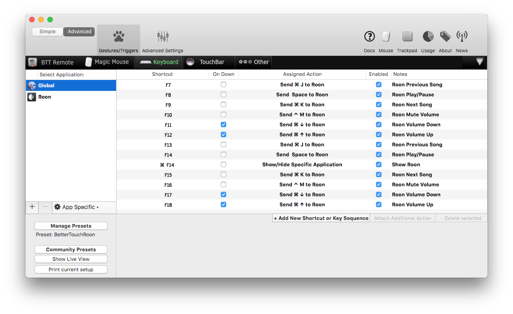
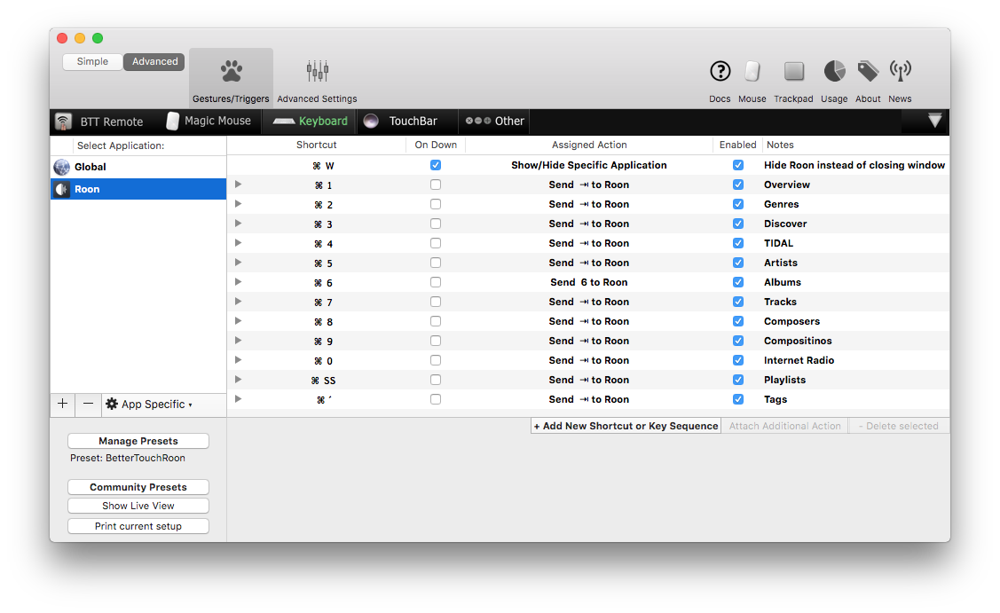
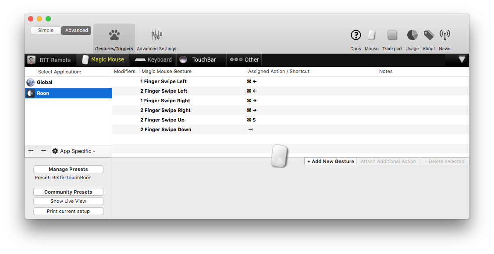
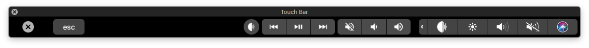
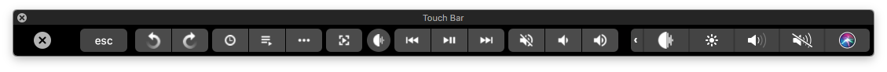
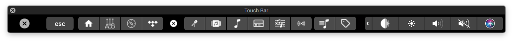
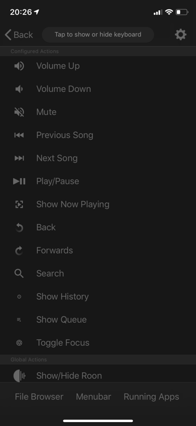

# BetterTouchRoon

A [BetterTouchTool](https://folivora.ai)-Preset to control the [Roon](https://roonlabs.com) desktop app for macOS on different ways.

⚠️ Note: The global shortcuts only work when the main Roon window is not closed. To avoid this, clicking the close button or pressing Cmd+W will just hide the Roon App when this Preset is active.

### Download

- [BetterTouchRoon (DE) Preset](raw/master/BetterTouchRoon (DE).bttpreset) for German keyboards
- [BetterTouchRoon (IT) Preset](raw/master/BetterTouchRoon (DE).bttpreset) for International keyboards (US/UK) 

### Installation

Double click the downloaded preset file and activate it under „Manage Presets“ in the bottom left of the BetterTouchTool window.

### Keyboard Shortcuts

Global Shortcuts

Shortcuts when Roon is active

### Mouse gestures for Magic Mouse

### Touch Bar controls with Control Strip button

Global Touch Bar

Touch Bar when Roon is active

Additional Views selector (tapping on the three dots)

### BTT Remote controls for iOS

